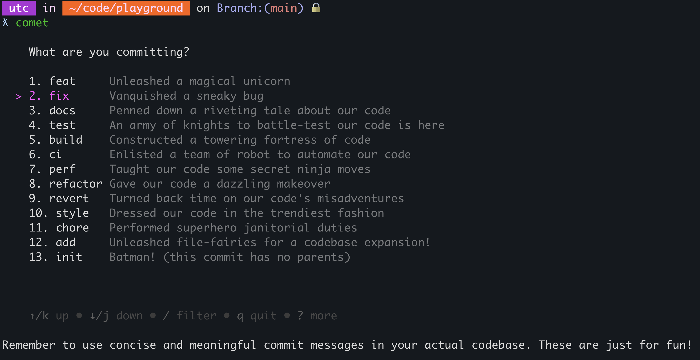

# Comet

Comet is a simple CLI tool that helps you to use [conventional commits](https://www.conventionalcommits.org/) with git.

You can call `comet` where you're normally type `git commit`. All flags supported in `git commit` will still work.



## Installation

Install with Go (1.17+):

```console
go install github.com/liamg/comet@latest
```

## Customisation

You can customise the options available by creating a `.comet.json` in the root of your repository, or in your home directory. The repository-level config will be preferred if it exists.

The content should be in the following format:

```json
[
  { "title":  "feat", "description":  "a new feature"},
  { "title":  "fix", "description":  "a bug fix"},
  { "title":  "bug", "description":  "introducing a bug"}
]
```
